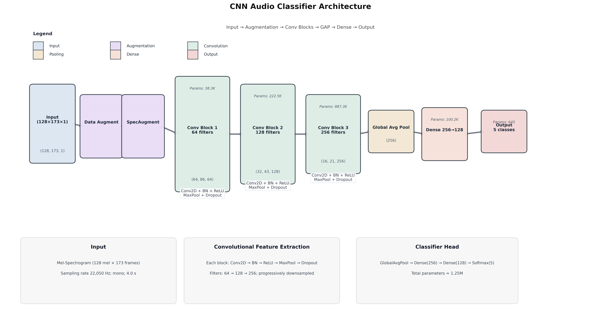

# Project-JST: Klasifikasi Emosi Suara Bahasa Indonesia menggunakan CNN

Repositori ini berisi implementasi lengkap klasifikasi sentimen suara berbahasa Indonesia menggunakan Convolutional Neural Networks (CNN). Proyek ini menggunakan dataset **IndoWaveSentiment** untuk mengklasifikasikan 5 emosi dari rekaman audio.

## 📋 Daftar Isi
- [Tentang Proyek](#tentang-proyek)
- [Struktur Repository](#struktur-repository)
- [Persyaratan Sistem](#persyaratan-sistem)
- [Instalasi](#instalasi)
- [Dataset](#dataset)
- [Penggunaan](#penggunaan)
- [Hasil dan Output](#hasil-dan-output)
- [Arsitektur Model](#arsitektur-model)
- [Troubleshooting](#troubleshooting)
- [Kontribusi](#kontribusi)

---

## 🎯 Tentang Proyek

Proyek ini bertujuan untuk mengklasifikasikan emosi dari rekaman suara berbahasa Indonesia menggunakan deep learning. Model CNN dilatih pada fitur spektrogram dari sinyal audio untuk mengenali pola emosi dalam ucapan.

**Komponen Utama:**
- ✅ Preprocessing audio dan ekstraksi fitur (Mel-spectrogram/MFCC)
- ✅ Arsitektur CNN untuk klasifikasi
- ✅ Model terlatih siap pakai (`cnn_best.h5`)
- ✅ Visualisasi arsitektur model
- ✅ Evaluasi performa dan prediksi

---

## 📁 Struktur Repository

```
Project-JST/
├── Data/
│   ├── IndoWaveSentiment/          # Dataset audio sentimen Indonesia
│   └── IndoWaveSentiment File Naming Guidelines.pdf
├── Output/
│   └── cnn_architecture_visualization.png  # Visualisasi arsitektur CNN
├── main.ipynb                       # Notebook utama (preprocessing, training, evaluasi)
├── cnn_best.h5                      # Model CNN terlatih (siap pakai)
├── requirement.txt                  # Daftar library yang dibutuhkan
└── README.md                        # Dokumentasi ini
```

---

## 💻 Persyaratan Sistem

- **OS:** Windows, Linux, atau macOS
- **Python:** 3.8 - 3.10 (disarankan 3.9)
- **RAM:** Minimal 8GB (16GB disarankan untuk training)
- **GPU:** Opsional (NVIDIA CUDA) untuk mempercepat training
- **Storage:** ~500MB untuk dependensi + ukuran dataset

---

## 🚀 Instalasi

### 1. Clone Repository

```bash
git clone https://github.com/qlbusalim/Project-JST.git
cd Project-JST
```

### 2. Buat Virtual Environment (Disarankan)

**Menggunakan venv:**
```bash
# Linux/Mac
python3 -m venv venv
source venv/bin/activate

# Windows
python -m venv venv
venv\Scripts\activate
```

**Atau menggunakan conda:**
```bash
conda create -n project-jst python=3.9
conda activate project-jst
```

### 3. Install Dependencies

```bash
pip install -r requirement.txt
```

**Library Utama yang Digunakan:**
- `tensorflow` / `keras` - Framework deep learning
- `librosa` - Pemrosesan audio
- `numpy`, `pandas` - Manipulasi data
- `matplotlib`, `seaborn` - Visualisasi
- `scikit-learn` - Evaluasi model
- `soundfile` - I/O audio

### 4. Install Jupyter (jika belum ada)

```bash
pip install jupyter notebook
# atau
pip install jupyterlab
```

### 5. Verifikasi Instalasi

```python
python -c "import tensorflow as tf; import librosa; print('TensorFlow:', tf.__version__); print('Librosa:', librosa.__version__)"
```

---

## 📊 Dataset

Proyek ini menggunakan **IndoWaveSentiment Dataset** yang berisi rekaman audio sentimen berbahasa Indonesia. 

**Lokasi:** `Data/IndoWaveSentiment/`

**Panduan Penamaan File:** Lihat `Data/IndoWaveSentiment File Naming Guidelines.pdf` untuk memahami konvensi penamaan dan struktur label dataset.

**Format Audio:**
- Format: `.wav`
- Sample rate: Biasanya 16 kHz atau 22.05 kHz
- Channel: Mono (disarankan)

---

## 📖 Penggunaan

### Menjalankan Notebook

1. **Aktifkan virtual environment:**
   ```bash
   source venv/bin/activate  # Linux/Mac
   venv\Scripts\activate      # Windows
   ```

2. **Jalankan Jupyter:**
   ```bash
   jupyter notebook
   # atau
   jupyter lab
   ```

3. **Buka `main.ipynb`** di browser Anda

4. **Jalankan cell secara berurutan** dari atas ke bawah

### Workflow dalam main.ipynb

Notebook `main.ipynb` mencakup langkah-langkah berikut:

#### 1️⃣ **Import Library dan Setup**
- Import semua library yang diperlukan
- Konfigurasi parameter (sample rate, hop length, n_mels, dll.)

#### 2️⃣ **Eksplorasi Data**
- Memuat dataset dari `Data/IndoWaveSentiment/`
- Analisis distribusi kelas sentimen
- Visualisasi waveform dan spektrogram contoh audio

#### 3️⃣ **Preprocessing Audio**
```python
# Contoh preprocessing:
# - Load audio dengan librosa
# - Resampling ke sample rate standar
# - Ekstraksi fitur (Mel-spectrogram atau MFCC)
# - Normalisasi
# - Augmentasi data (opsional)
```

#### 4️⃣ **Pembangunan Model CNN**
```python
# Arsitektur CNN mencakup:
# - Conv2D layers untuk ekstraksi fitur
# - MaxPooling untuk downsampling
# - Batch Normalization
# - Dropout untuk regularisasi
# - Dense layers untuk klasifikasi
```

#### 5️⃣ **Training Model**
```python
# Parameter training:
# - Optimizer: Adam
# - Loss: categorical_crossentropy
# - Metrics: accuracy
# - Callbacks: ModelCheckpoint, EarlyStopping
```

#### 6️⃣ **Evaluasi Model**
- Menghitung akurasi, precision, recall, F1-score
- Confusion matrix
- Visualisasi learning curves (loss & accuracy)

#### 7️⃣ **Prediksi Audio Baru**
```python
# Fungsi untuk memprediksi sentimen dari file audio baru
# Input: path ke file . wav
# Output: label sentimen dan probabilitas
```

### Menggunakan Model Terlatih

Jika Anda ingin langsung menggunakan model tanpa training ulang:

```python
from tensorflow import keras
import librosa
import numpy as np

# Load model
model = keras.models.load_model('cnn_best.h5')

# Load dan preprocess audio baru
def predict_emotion(audio_path):
    # Load audio
    y, sr = librosa.load(audio_path, sr=22050)
    
    # Ekstraksi fitur (sesuaikan dengan preprocessing training)
    mel_spec = librosa.feature. melspectrogram(y=y, sr=sr, n_mels=128)
    mel_spec_db = librosa. power_to_db(mel_spec, ref=np.max)
    
    # Reshape untuk input CNN
    mel_spec_db = mel_spec_db[np.newaxis, .. ., np.newaxis]
    
    # Prediksi
    prediction = model.predict(mel_spec_db)
    
    return prediction

# Contoh penggunaan
result = predict_emotion('path/to/your/audio.wav')
print(f"Prediksi Kelas Emosi: {result}")
```

---

## 📈 Hasil dan Output

### Model Terlatih
- **File:** `cnn_best.h5`
- **Ukuran:** ~15 MB
- **Format:** Keras HDF5

### Visualisasi
- **Arsitektur CNN:** `Output/cnn_architecture_visualization. png`
  
  

### Metrik Performa
(Anda dapat menambahkan hasil evaluasi model di sini setelah training, misalnya:)
- Akurasi Training: XX%
- Akurasi Validasi: XX%
- Akurasi Test: XX%

---

## 🏗️ Arsitektur Model

Visualisasi lengkap arsitektur CNN dapat dilihat di `Output/cnn_architecture_visualization.png`. 

**Ringkasan Arsitektur:**
```
Input (Mel-spectrogram)
    ↓
Conv2D → BatchNorm → ReLU → MaxPool
    ↓
Conv2D → BatchNorm → ReLU → MaxPool
    ↓
Conv2D → BatchNorm → ReLU → MaxPool
    ↓
Flatten
    ↓
Dense → Dropout → ReLU
    ↓
Dense (Output - Softmax)
```

---

## 🔧 Troubleshooting

### ❌ Error: Module not found
**Solusi:**
```bash
pip install -r requirement.txt --upgrade
```

### ❌ Error: Could not load audio file
**Solusi:**
- Pastikan file audio dalam format `. wav`
- Install `soundfile`: `pip install soundfile`
- Periksa path file sudah benar

### ❌ Error: ResourceExhaustedError (GPU memory)
**Solusi:**
- Kurangi batch size
- Gunakan CPU: `os.environ['CUDA_VISIBLE_DEVICES'] = '-1'`
- Bersihkan memory: `keras.backend.clear_session()`

### ❌ Model training sangat lambat
**Solusi:**
- Gunakan GPU jika tersedia
- Kurangi ukuran data training
- Gunakan model yang lebih sederhana

### ❌ Akurasi rendah
**Solusi:**
- Tambah epoch training
- Gunakan data augmentation
- Tune hyperparameter (learning rate, dropout rate)
- Coba arsitektur model yang berbeda

---

## 🤝 Kontribusi

Kontribusi sangat diterima! Jika Anda ingin berkontribusi:

1. Fork repository ini
2. Buat branch baru (`git checkout -b feature/AmazingFeature`)
3.  Commit perubahan (`git commit -m 'Add some AmazingFeature'`)
4. Push ke branch (`git push origin feature/AmazingFeature`)
5. Buat Pull Request

---

## 📝 Lisensi

Proyek ini dibuat untuk keperluan akademis/penelitian. Silakan hubungi pemilik repo untuk informasi lisensi lebih lanjut. 

---

## 👤 Kontak

**Dikembangkan oleh:** [@qlbusalim](https://github.com/qlbusalim)

Untuk pertanyaan, saran, atau kolaborasi:
- Buka [Issues](https://github.com/qlbusalim/Project-JST/issues) di repository ini
- Hubungi melalui profil GitHub

---

## 🙏 Acknowledgments

- Dataset: IndoWaveSentiment
- Framework: TensorFlow/Keras
- Audio Processing: Librosa

---

**⭐ Jika proyek ini bermanfaat, jangan lupa berikan star! **
